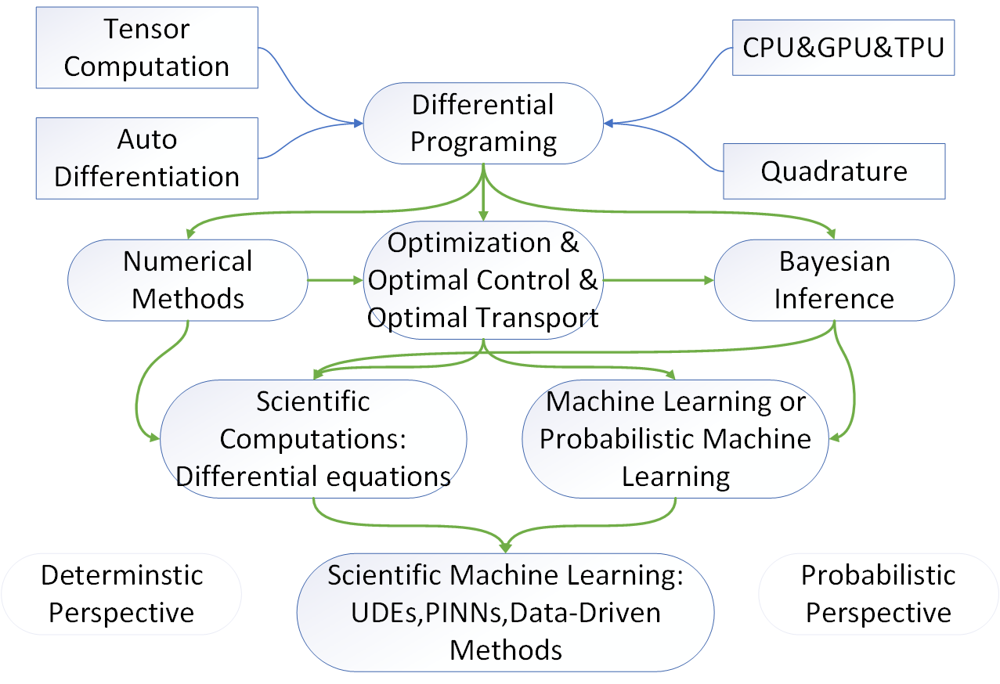

@def title = "MathEpiDeepLearning"
# MathEpiDeepLearning
See [Website of MathEpiDeepLearning](https://song921012.github.io/MathEpiDeepLearning/)

Guides on contributions:

- Open issues to add source links
- Fork and pull requests

Also see its twin repo [MathEpiDeepLearningTutorial: Tutorials on math epidemiology and epidemiology informed deep learning methods](https://github.com/Song921012/MathEpiDeepLearningTutorial).

Contents:

- [ Introduction](#head1)
- [0. Epidemic Model](#head79)
- [1. Data Preprocessing](#head2)
  
  - [1.1. Data Science](#head3)
  - [ Smoothing](#head4)
  - [Outlier Detection](#head75)
- [2. Basic Statistics and Data Visualization](#head5)
  
  - [2.1. Statistics](#head6)
  - [2.2. (Deep Learning based) Time Seris Analysis](#head7)
  - [2.3. Survival Analysis](#head8)
  - [2.4. Data Visulization](#head9)
  - [2.5. GLM](#head76)
- [3. Differential Programing and Data Mining](#head10)
  
  - [3.1. Differentialation, Quadrature and Tensor computation](#head11)
    - [3.1.1. Auto Differentiation](#head12)
      - [Auto Difference](#head13)
    - [3.1.2. Quadrature](#head14)
      - [Bayesian Methods](#head15)
      - [Expectations calculation](#head16)
    - [3.1.3. Matrix and Tensor computation](#head17)
      - [Special Matrix](#head18)
      - [ Eigenvalues](#head19)
      - [Maps and Operators](#head20)
      - [Matrxi Equations](#head21)
      - [Kronecker-based algebra](#head22)
    - [3.1.4. CPU, GPU and TPU](#head23)
  - [3.2. Optimization](#head24)
    - [3.2.1. Metaheuristic](#head25)
    - [3.2.2. Evolution Stragegy](#head26)
    - [3.2.3. Genetic Algorithms](#head27)
    - [3.2.4. Nonconvex](#head28)
  - [3.3. Optimal Control](#head29)
  - [3.4. Bayesian Inference](#head30)
    - [3.4.1. MCMC](#head31)
    - [3.4.2. Approximate Bayesian Computation (ABC)](#head32)
    - [3.4.3. Data Assimilation (SMC, particles filter)](#head33)
    - [3.4.4. Variational Inference](#head34)
    - [3.4.5. Gaussion, non-Gaussion and Kernel](#head35)
    - [3.4.6. Bayesian Optimization](#head36)
    - [3.4.7. Information theory](#head37)
    - [3.4.8. Uncertanty](#head38)
    - [3.4.9. Casual](#head39)
    - [3.4.10. Sampling](#head40)
  - [3.5. Machine Learning and Deep Learning](#head41)
    - [3.5.1. Machine Learning](#head42)
    - [3.5.2. Deep Learning](#head43)
    - [3.5.3. Reinforce Learning](#head44)
    - [3.5.4. GNN](#head45)
    - [3.5.5. Transformer](#head46)
    - [3.5.6. Transfer Learning](#head47)
    - [3.5.7. Neural Tangent](#head48)
    - [3.5.8. Visulization](#head49)
  - [3.6. Probablistic Machine Learning and Deep Learning](#head50)
    - [3.6.1. GAN](#head51)
    - [3.6.2. Normilization Flows](#head52)
    - [3.6.3. VAE](#head53)
  - [3.7. Differential Equations and Scientific Computation](#head54)
    - [3.7.1. Partial differential equation](#head55)
  - [3.8. Scientific Machine Learning (Differential Equation and ML)](#head56)
    - [3.8.1. Universal Differential Equations. (Neural differential equations)](#head57)
    - [3.8.2. Physical Informed Neural Netwworks](#head58)
    - [3.8.3. Neural Operator](#head59)
  - [3.9. Data Driven Methods (Equation Searching Methods)](#head60)
    - [3.9.1. Symbolic Regression](#head61)
    - [3.9.2. SINDy (Sparse Identification of Nonlinear Dynamics from Data)](#head62)
    - [3.9.3. DMD (Dynamic Mode Decomposition)](#head63)
  - [3.10. Model Evaluation](#head64)
    - [3.10.1. Structure Idendification](#head65)
    - [3.10.2. Global Sensitivity Anylysis](#head66)
  - [3.10. Optimal Transportation](#head77)
  - [3.11. Agents, Graph and Networks](#head81)
- [4. Theoretical Analysis](#head67)
  
  - [4.0. Special Functions](#head68)
  - [4.1. Symbolic Computation](#head69)
  - [4.3. Roots, Intepolations](#head70)
    - [4.3.1. Roots](#head71)
    - [4.3.2. Intepolations](#head72)
  - [4.2. Bifurcation](#head73)
- [5. Writings, Blog and Web](#head74)
  
  #  Introduction
  
  Julia and Python resources on mathematical epidemiology and epidemiology informed deep learning methods. Most about package information. Main Topics include
  
- Data Preprocessing
  
- Basic Statistics and Data Visualization
  
- Differential Programing and Data Mining 
  such as bayesian inference, deep learning, scientific machine learning computation
  
- Theoretical Analysis
  such as calculus, bifurcation analysis
  
- Writings, Blog and Web
  

[TOC]

Data Sources:

[EpiData](DataSources/EpiData.md)

[MLData](DataSources/MLData.md)

[Rdatasets](DataSources/Rdatasets.md)

[JuliaDatasets](DataSources/JuliaDatasets.md)

[DataIOTools](DataSources/DataIOtools.md)
# 0. Epidemic Model
Epidemiology meets Data Mining
and Knowledge discovery[epiDAMIK Workshop](https://epidamik.github.io/)

[Epidemic model repos collections](/EpiRepos/EpidemicRepos.md)

Julia: 

[epirecipes/sir-julia: Various implementations of the classical SIR model in Julia](https://github.com/epirecipes/sir-julia)

[jangevaare/Pathogen.jl: Simulation, visualization, and inference tools for modelling the spread of infectious diseases with Julia](https://github.com/jangevaare/Pathogen.jl)

Mobility[jtmatamalas/MMCAcovid19.jl: Microscopic Markov Chain Approach to model the spreading of COVID-19](https://github.com/jtmatamalas/MMCAcovid19.jl)

[jpfairbanks/SemanticModels.jl: A julia package for representing and manipulating model semantics](https://github.com/jpfairbanks/SemanticModels.jl)

[cambridge-mlg/Covid19](https://github.com/cambridge-mlg/Covid19)

[affans/covid19abm.jl: Agent Based Model for COVID 19 transmission dynamics](https://github.com/affans/covid19abm.jl)

Python:

[ryansmcgee/seirsplus: Models of SEIRS epidemic dynamics with extensions, including network-structured populations, testing, contact tracing, and social distancing.](https://github.com/ryansmcgee/seirsplus)

[pyro.contrib.epidemiology.models — Pyro documentation](https://docs.pyro.ai/en/stable/_modules/pyro/contrib/epidemiology/models.html#HeterogeneousSIRModel)

Modelling Human Mobility
[scikit-mobility/scikit-mobility: scikit-mobility: mobility analysis in Python](https://github.com/scikit-mobility/scikit-mobility)

Matlab:

[JDureau/AllScripts](https://github.com/JDureau/AllScripts)

# 1. Data Preprocessing

## 1.1. Data Science

Julia:

[JuliaData](https://github.com/JuliaData)

[JuliaData/CSV.jl: Utility library for working with CSV and other delimited files in the Julia programming language](https://github.com/JuliaData/CSV.jl)

[JuliaData/DataFrames.jl: In-memory tabular data in Julia](https://github.com/JuliaData/DataFrames.jl)

[JuliaStats/TimeSeries.jl: Time series toolkit for Julia](https://github.com/JuliaStats/TimeSeries.jl)

[Queryverse](https://github.com/queryverse)

[JuliaDatabases](https://github.com/JuliaDatabases)

Python:

Numpy

Pandas

##  Smoothing

[viraltux/Smoothers.jl: Collection of basic smoothers and smoothing related applications](https://github.com/viraltux/Smoothers.jl)

Expotential Smoothing:

[LAMPSPUC/StateSpaceModels.jl: StateSpaceModels.jl is a Julia package for time-series analysis using state-space models.](https://github.com/LAMPSPUC/StateSpaceModels.jl)

[miguelraz/StagedFilters.jl](https://github.com/miguelraz/StagedFilters.jl)

[JuliaDSP/DSP.jl: Filter design, periodograms, window functions, and other digital signal processing functionality](https://github.com/JuliaDSP/DSP.jl)

[konkam/FeynmanKacParticleFilters.jl: Particle filtering using the Feynman-Kac formalism](https://github.com/konkam/FeynmanKacParticleFilters.jl)

[mschauer/Kalman.jl: Flexible filtering and smoothing in Julia](https://github.com/mschauer/Kalman.jl)

[JuliaStats/Loess.jl: Local regression, so smooooth!](https://github.com/JuliaStats/Loess.jl)

[CliMA/EnsembleKalmanProcesses.jl: Implements Optimization and approximate uncertainty quantification algorithms, Ensemble Kalman Inversion, and Ensemble Kalman Processes.](https://github.com/CliMA/EnsembleKalmanProcesses.jl)

##  Outlier Detection
Survey[rob-med/awesome-TS-anomaly-detection: List of tools & datasets for anomaly detection on time-series data.](https://github.com/rob-med/awesome-TS-anomaly-detection)

Julia:

[OutlierDetectionJL](https://github.com/OutlierDetectionJL)

[baggepinnen/MatrixProfile.jl: Time-series analysis using the Matrix profile in Julia](https://github.com/baggepinnen/MatrixProfile.jl)

[jbytecode/LinRegOutliers: Direct and robust methods for outlier detection in linear regression](https://github.com/jbytecode/LinRegOutliers)

Python:

[yzhao062/pyod: A Python Toolbox for Scalable Outlier Detection (Anomaly Detection)](https://github.com/yzhao062/pyod)

[cerlymarco/tsmoothie: A python library for time-series smoothing and outlier detection in a vectorized way.](https://github.com/cerlymarco/tsmoothie)

[DHI/tsod: Anomaly Detection for time series data](https://github.com/DHI/tsod)

# 2. Basic Statistics and Data Visualization

## 2.1. Statistics

[Julia Statistics](https://github.com/JuliaStats)

[gragusa (Giuseppe Ragusa)](https://github.com/gragusa)

[cscherrer/MeasureTheory.jl: "Distributions" that might not add to one.](https://github.com/cscherrer/MeasureTheory.jl)

## 2.2. (Deep Learning based) Time Seris Analysis

Julia: (few)

[JuliaStats/TimeSeries.jl: Time series toolkit for Julia](file:///F:/Zotero/Zotero/storage/GJAUE3T5/TimeSeries.html)

[JuliaDynamics/ARFIMA.jl: Simulate stochastic timeseries that follow ARFIMA, ARMA, ARIMA, AR, etc. processes](https://github.com/JuliaDynamics/ARFIMA.jl)

Python:

Survey[MaxBenChrist/awesome_time_series_in_python: This curated list contains python packages for time series analysis](https://github.com/MaxBenChrist/awesome_time_series_in_python)

[Introduction — statsmodels](file:///F:/Zotero/Zotero/storage/JRHBIF8V/index.html)

[unit8co/darts: A python library for easy manipulation and forecasting of time series.](https://github.com/unit8co/darts)

[jdb78/pytorch-forecasting: Time series forecasting with PyTorch](https://github.com/jdb78/pytorch-forecasting)

[AIStream-Peelout/flow-forecast: Deep learning PyTorch library for time series forecasting, classification, and anomaly detection (originally for flood forecasting).](https://github.com/AIStream-Peelout/flow-forecast)

[timeseriesAI/tsai: Time series Timeseries Deep Learning Machine Learning Pytorch fastai | State-of-the-art Deep Learning library for Time Series and Sequences in Pytorch / fastai](https://github.com/timeseriesAI/tsai)

[tslearn-team/tslearn: A machine learning toolkit dedicated to time-series data](https://github.com/tslearn-team/tslearn)

[salesforce/Merlion: Merlion: A Machine Learning Framework for Time Series Intelligence](https://github.com/salesforce/Merlion)

[ourownstory/neural_prophet: NeuralProphet: A simple forecasting package](https://github.com/ourownstory/neural_prophet)

[alan-turing-institute/sktime: A unified framework for machine learning with time series](https://github.com/alan-turing-institute/sktime)

[sktime/sktime-dl: sktime companion package for deep learning based on TensorFlow](https://github.com/sktime/sktime-dl)

[IBM/TSML.jl: A package for time series data processing, classification, clustering, and prediction.](https://github.com/IBM/TSML.jl)

[alkaline-ml/pmdarima: A statistical library designed to fill the void in Python's time series analysis capabilities, including the equivalent of R's auto.arima function.](https://github.com/alkaline-ml/pmdarima)

[zhouhaoyi/Informer2020: The GitHub repository for the paper "Informer" accepted by AAAI 2021.](https://github.com/zhouhaoyi/Informer2020)

[blue-yonder/tsfresh: Automatic extraction of relevant features from time series:](https://github.com/blue-yonder/tsfresh)

[microsoft/forecasting: Time Series Forecasting Best Practices & Examples](https://github.com/microsoft/forecasting)

[TDAmeritrade/stumpy: STUMPY is a powerful and scalable Python library for modern time series analysis](https://github.com/TDAmeritrade/stumpy)

## 2.3. Survival Analysis

Julia:

Python:

[CamDavidsonPilon/lifelines: Survival analysis in Python](https://github.com/camDavidsonPilon/lifelines)

## 2.4. Data Visulization

[Data Visualization Resources]([DataVisualization/dataviz.md])

Julia:

[JuliaPlots](https://github.com/JuliaPlots)

[GiovineItalia/Gadfly.jl: Crafty statistical graphics for Julia.](https://github.com/GiovineItalia/Gadfly.jl)

[queryverse/VegaLite.jl: Julia bindings to Vega-Lite](https://github.com/queryverse/VegaLite.jl)

[JuliaPlots/UnicodePlots.jl: Unicode-based scientific plotting for working in the terminal](https://github.com/JuliaPlots/UnicodePlots.jl)

Colors and Color schemes

[JuliaGraphics/Colors.jl: Color manipulation utilities for Julia](https://github.com/JuliaGraphics/Colors.jl)

[JuliaGraphics/ColorSchemes.jl: colorschemes, colormaps, gradients, and palettes](https://github.com/JuliaGraphics/ColorSchemes.jl)

Interactive

[GenieFramework/Stipple.jl: The reactive UI library for interactive data applications with pure Julia.](https://github.com/GenieFramework/Stipple.jl)

[theogf/Turkie.jl: Turing + Makie = Turkie](https://github.com/theogf/Turkie.jl)

Python:

Matplotlib

[rougier/scientific-visualization-book: An open access book on scientific visualization using python and matplotlib](https://github.com/rougier/scientific-visualization-book)

R:

Color themes:

[discrete.knit](https://emilhvitfeldt.github.io/r-color-palettes/discrete.html)

### Venn Diagrams:

R:

[yanlinlin82/ggvenn: Venn Diagram by ggplot2, with really easy-to-use API.](https://github.com/yanlinlin82/ggvenn)

[gaospecial/ggVennDiagram: A 'ggplot2' implement of Venn Diagram.](https://github.com/gaospecial/ggVennDiagram)

Python:

[konstantint/matplotlib-venn: Area-weighted venn-diagrams for Python/matplotlib](https://github.com/konstantint/matplotlib-venn)

Julia:

[JuliaPlots/VennEuler.jl: Venn/Euler Diagrams for Julia](https://github.com/JuliaPlots/VennEuler.jl)

## 2.5. GLM

[bambinos/bambi: BAyesian Model-Building Interface (Bambi) in Python.](https://github.com/bambinos/bambi)

# 3. Differential Programing and Data Mining

## 3.1. Differentialation, Quadrature and Tensor computation

### 3.1.1. Auto Differentiation

[SciML/DiffEqSensitivity.jl: A component of the DiffEq ecosystem for enabling sensitivity analysis for scientific machine learning (SciML). Optimize-then-discretize, discretize-then-optimize, and more for ODEs, SDEs, DDEs, DAEs, etc.](https://github.com/SciML/DiffEqSensitivity.jl)

Julia:

[FluxML/Zygote.jl: Intimate Affection Auditor](https://github.com/FluxML/Zygote.jl)

JuliaDiffEqFlux organization

[JuliaDiff](https://github.com/JuliaDiff)

[JuliaDiff/ForwardDiff.jl: Forward Mode Automatic Differentiation for Julia](https://github.com/JuliaDiff/ForwardDiff.jl)

[JuliaDiff/ReverseDiff.jl: Reverse Mode Automatic Differentiation for Julia](https://github.com/JuliaDiff/ReverseDiff.jl)

[JuliaDiff/AbstractDifferentiation.jl: An abstract interface for automatic differentiation.](https://github.com/JuliaDiff/AbstractDifferentiation.jl)

[JuliaDiff/TaylorSeries.jl: A julia package for Taylor polynomial expansions in one and several independent variables.](https://github.com/JuliaDiff/TaylorSeries.jl)

[kailaix/ADCME.jl: Automatic Differentiation Library for Computational and Mathematical Engineering](https://github.com/kailaix/ADCME.jl)

[chakravala/Leibniz.jl: Tensor algebra utility library](https://github.com/chakravala/Leibniz.jl)

[briochemc/F1Method.jl: F-1 method](https://github.com/briochemc/F1Method.jl)

Python:

[google/jax: Composable transformations of Python+NumPy programs: differentiate, vectorize, JIT to GPU/TPU, and more](https://github.com/google/jax)

[pytorch/pytorch: Tensors and Dynamic neural networks in Python with strong GPU acceleration](https://github.com/pytorch/pytorch)

[tensorflow/tensorflow: An Open Source Machine Learning Framework for Everyone](https://github.com/tensorflow/tensorflow)

[AMICI-dev/AMICI: Advanced Multilanguage Interface to CVODES and IDAS](https://github.com/AMICI-dev/AMICI)

#### Auto Difference

Julia:

[SciML/DiffEqOperators.jl: Linear operators for discretizations of differential equations and scientific machine learning (SciML)](https://github.com/SciML/DiffEqOperators.jl)

[QuantEcon/SimpleDifferentialOperators.jl: Library for simple upwind finite differences](https://github.com/QuantEcon/SimpleDifferentialOperators.jl)

Python:

[maroba/findiff: Python package for numerical derivatives and partial differential equations in any number of dimensions.](https://github.com/maroba/findiff)

### 3.1.2. Quadrature

Learn One equals learn many

[SciML/Quadrature.jl: A common interface for quadrature and numerical integration for the SciML scientific machine learning organization](https://github.com/SciML/Quadrature.jl)

[SciML/QuasiMonteCarlo.jl: Lightweight and easy generation of quasi-Monte Carlo sequences with a ton of different methods on one API for easy parameter exploration in scientific machine learning (SciML)](https://github.com/SciML/QuasiMonteCarlo.jl)

Julia:

[JuliaMath/QuadGK.jl: adaptive 1d numerical Gauss–Kronrod integration in Julia](https://github.com/JuliaMath/QuadGK.jl)

[JuliaMath/HCubature.jl: pure-Julia multidimensional h-adaptive integration](https://github.com/JuliaMath/HCubature.jl)

[JuliaMath/Cubature.jl: One- and multi-dimensional adaptive integration routines for the Julia language](https://github.com/JuliaMath/Cubature.jl)

[giordano/Cuba.jl: Library for multidimensional numerical integration with four independent algorithms: Vegas, Suave, Divonne, and Cuhre.](https://github.com/giordano/Cuba.jl)

[JuliaApproximation/FastGaussQuadrature.jl: Julia package for Gaussian quadrature](https://github.com/JuliaApproximation/FastGaussQuadrature.jl)

[JuliaApproximation/ApproxFun.jl: Julia package for function approximation](https://github.com/JuliaApproximation/ApproxFun.jl)

[machakann/DoubleExponentialFormulas.jl: One-dimensional numerical integration using the double exponential formula](https://github.com/machakann/DoubleExponentialFormulas.jl)

[JuliaApproximation/SingularIntegralEquations.jl: Julia package for solving singular integral equations](https://github.com/JuliaApproximation/SingularIntegralEquations.jl)

[JuliaGNI/GeometricIntegrators.jl: Geometric Numerical Integration in Julia](https://github.com/JuliaGNI/GeometricIntegrators.jl)

#### Bayesian Methods

Julia:

[ranjanan/MonteCarloIntegration.jl: A package for multi-dimensional integration using monte carlo methods](https://github.com/ranjanan/MonteCarloIntegration.jl)

[theogf/BayesianQuadrature.jl: Is there anything we can't make Bayesian?](https://github.com/theogf/BayesianQuadrature.jl)

[s-baumann/BayesianIntegral.jl: Bayesian Integration of functions](https://github.com/s-baumann/BayesianIntegral.jl)

[theogf/BayesianQuadrature.jl: Is there anything we can't make Bayesian?](https://github.com/theogf/BayesianQuadrature.jl)

#### Expectations calculation

[QuantEcon/Expectations.jl: Expectation operators for Distributions.jl objects](https://github.com/QuantEcon/Expectations.jl)

### 3.1.3. Matrix and Tensor computation

Matrix organization

[JuliaArrays](https://github.com/JuliaArrays)

[JuliaMatrices](https://github.com/JuliaMatrices)

[RalphAS](https://github.com/RalphAS)

[JuliaLinearAlgebra](https://github.com/JuliaLinearAlgebra)

#### Special Matrix

[JuliaMatrices/SpecialMatrices.jl: Julia package for working with special matrix types.](https://github.com/JuliaMatrices/SpecialMatrices.jl)

####  Eigenvalues

[nep-pack/NonlinearEigenproblems.jl: Nonlinear eigenvalue problems in Julia: Iterative methods and benchmarks](https://github.com/nep-pack/NonlinearEigenproblems.jl)

Julia:

[JuliaLinearAlgebra/ArnoldiMethod.jl: Implicitly Restarted Arnoldi Method, natively in Julia](https://github.com/JuliaLinearAlgebra/ArnoldiMethod.jl)

[Jutho/KrylovKit.jl: Krylov methods for linear problems, eigenvalues, singular values and matrix functions](https://github.com/Jutho/KrylovKit.jl)

[JuliaInv/KrylovMethods.jl: Simple and fast Julia implementation of Krylov subspace methods for linear systems.](https://github.com/JuliaInv/KrylovMethods.jl)

[JuliaSmoothOptimizers/Krylov.jl: A Julia Basket of Hand-Picked Krylov Methods](https://github.com/JuliaSmoothOptimizers/Krylov.jl)

[JuliaLinearAlgebra/IterativeSolvers.jl: Iterative algorithms for solving linear systems, eigensystems, and singular value problems](https://github.com/JuliaLinearAlgebra/IterativeSolvers.jl)

[pablosanjose/QuadEig.jl: Julia implementation of the `quadeig` algorithm for the solution of quadratic matrix pencils](https://github.com/pablosanjose/QuadEig.jl)

[JuliaApproximation/SpectralMeasures.jl: Julia package for finding the spectral measure of structured self adjoint operators](https://github.com/JuliaApproximation/SpectralMeasures.jl)

[tpapp/SpectralKit.jl: Building blocks of spectral methods for Julia.](https://github.com/tpapp/SpectralKit.jl)

Python:

[scipy.sparse.linalg.eigs — SciPy v1.7.1 Manual](https://docs.scipy.org/doc/scipy/reference/generated/scipy.sparse.linalg.eigs.html?highlight=scipy%20sparse%20linalg%20eigs#scipy.sparse.linalg.eigs)

#### Maps and Operators

[Jutho/LinearMaps.jl: A Julia package for defining and working with linear maps, also known as linear transformations or linear operators acting on vectors. The only requirement for a LinearMap is that it can act on a vector (by multiplication) efficiently.](https://github.com/Jutho/LinearMaps.jl)

[emmt/LazyAlgebra.jl: A Julia package to extend the notion of vectors and matrices](https://github.com/emmt/LazyAlgebra.jl)

[JuliaSmoothOptimizers/LinearOperators.jl: Linear Operators for Julia](https://github.com/JuliaSmoothOptimizers/LinearOperators.jl)

[kul-optec/AbstractOperators.jl: Abstract operators for large scale optimization in Julia](https://github.com/kul-optec/AbstractOperators.jl)

[matthieugomez/InfinitesimalGenerators.jl: A set of tools to work with Markov Processes](https://github.com/matthieugomez/InfinitesimalGenerators.jl)

[ranocha/SummationByPartsOperators.jl: A Julia library of summation-by-parts (SBP) operators used in finite difference, Fourier pseudospectral, continuous Galerkin, and discontinuous Galerkin methods to get provably stable semidiscretizations, paying special attention to boundary conditions.](https://github.com/ranocha/SummationByPartsOperators.jl)

[hakkelt/FunctionOperators.jl: Julia package that allows writing code close to mathematical notation memory-efficiently.](https://github.com/hakkelt/FunctionOperators.jl)

[JuliaApproximation/ApproxFun.jl: Julia package for function approximation](https://github.com/JuliaApproximation/ApproxFun.jl)

#### Matrxi Equations

[andreasvarga/MatrixEquations.jl: Solution of Lyapunov, Sylvester and Riccati matrix equations using Julia](https://github.com/andreasvarga/MatrixEquations.jl)

#### Kronecker-based algebra

[MichielStock/Kronecker.jl: A general-purpose toolbox for efficient Kronecker-based algebra.](https://github.com/MichielStock/Kronecker.jl)

### 3.1.4. CPU, GPU and TPU

Julia GPU organization

[JuliaGPU](https://github.com/JuliaGPU)

## 3.2. Optimization

An "learn one equals learn all" Julia Package

[SciML/GalacticOptim.jl: Local, global, and beyond optimization for scientific machine learning (SciML)](https://github.com/SciML/GalacticOptim.jl)

Opt Organization:

[JuliaOpt](https://github.com/JuliaOpt)

[JuliaNLSolvers](https://github.com/JuliaNLSolvers)

[Process Systems and Operations Research Laboratory](https://github.com/PSORLab)

[JuliaNLSolvers/Optim.jl: Optimization functions for Julia](https://github.com/JuliaNLSolvers/Optim.jl)

[JuliaOpt/NLopt.jl: Package to call the NLopt nonlinear-optimization library from the Julia language](https://github.com/JuliaOpt/NLopt.jl)

[robertfeldt/BlackBoxOptim.jl: Black-box optimization for Julia](https://github.com/robertfeldt/BlackBoxOptim.jl)

[jump-dev/MathOptInterface.jl: An abstraction layer for mathematical optimization solvers.](https://github.com/jump-dev/MathOptInterface.jl)

[tpapp/MultistartOptimization.jl: Multistart optimization methods in Julia.](https://github.com/tpapp/MultistartOptimization.jl)

[bbopt/NOMAD.jl: Julia interface to the NOMAD blackbox optimization software](https://github.com/bbopt/NOMAD.jl)

[JuliaFirstOrder](https://github.com/JuliaFirstOrder)

[NicolasL-S/SpeedMapping.jl: General fixed point mapping acceleration and optimization in Julia](https://github.com/NicolasL-S/SpeedMapping.jl)

### 3.2.1. Metaheuristic

Julia:

[jmejia8/Metaheuristics.jl: High performance metaheuristics for optimization purely coded in Julia.](https://github.com/jmejia8/Metaheuristics.jl)

[ac-tuwien/MHLib.jl: MHLib.jl - A Toolbox for Metaheuristics and Hybrid Optimization Methods in Julia](https://github.com/ac-tuwien/MHLib.jl)

Python:

[guofei9987/scikit-opt: Genetic Algorithm, Particle Swarm Optimization, Simulated Annealing, Ant Colony Optimization Algorithm,Immune Algorithm, Artificial Fish Swarm Algorithm, Differential Evolution and TSP(Traveling salesman)](https://github.com/guofei9987/scikit-opt)

[scikit-optimize/scikit-optimize: Sequential model-based optimization with a `scipy.optimize` interface](https://github.com/scikit-optimize/scikit-optimize)

[ac-tuwien/pymhlib: pymhlib - A Toolbox for Metaheuristics and Hybrid Optimization Methods](https://github.com/ac-tuwien/pymhlib)

[cvxpy/cvxpy: A Python-embedded modeling language for convex optimization problems.](https://github.com/cvxpy/cvxpy)

[coin-or/pulp: A python Linear Programming API](https://github.com/coin-or/pulp)

### 3.2.2. Evolution Stragegy

Julia:

[wildart/Evolutionary.jl: Evolutionary & genetic algorithms for Julia](https://github.com/wildart/Evolutionary.jl)

[d9w/Cambrian.jl: An Evolutionary Computation framework](https://github.com/d9w/Cambrian.jl)

[jbrea/CMAEvolutionStrategy.jl](https://github.com/jbrea/CMAEvolutionStrategy.jl)

[AStupidBear/GCMAES.jl: Gradient-based Covariance Matrix Adaptation Evolutionary Strategy for Real Blackbox Optimization](https://github.com/AStupidBear/GCMAES.jl)

[itsdfish/DifferentialEvolutionMCMC.jl: A Julia package for Differential Evolution MCMC](https://github.com/itsdfish/DifferentialEvolutionMCMC.jl)

### 3.2.3. Genetic Algorithms

Julia:

[d9w/CartesianGeneticProgramming.jl: Cartesian Genetic Programming for Julia](https://github.com/d9w/CartesianGeneticProgramming.jl)

[WestleyArgentum/GeneticAlgorithms.jl: A lightweight framework for writing genetic algorithms in Julia](https://github.com/WestleyArgentum/GeneticAlgorithms.jl)

Python:

[trevorstephens/gplearn: Genetic Programming in Python, with a scikit-learn inspired API](https://github.com/trevorstephens/gplearn)

### 3.2.4. Nonconvex

Julia:

[JuliaNonconvex/Nonconvex.jl: Toolbox for non-convex constrained optimization.](https://github.com/JuliaNonconvex/Nonconvex.jl)

## 3.3. Optimal Control

Julia: Jump + InfiniteOpt

Jump is powerfull!!!

[jump-dev/JuMP.jl: Modeling language for Mathematical Optimization (linear, mixed-integer, conic, semidefinite, nonlinear)](https://github.com/jump-dev/JuMP.jl)

InfiniteOpt is powerfull!!!

[pulsipher/InfiniteOpt.jl: An intuitive modeling interface for infinite-dimensional optimization problems.](https://github.com/pulsipher/InfiniteOpt.jl)

[PSORLab/EAGO.jl: A development environment for robust and global optimization](https://github.com/PSORLab/EAGO.jl)

[JuliaSmoothOptimizers/PDENLPModels.jl: A NLPModel API for optimization problems with PDE-constraints](https://github.com/JuliaSmoothOptimizers/PDENLPModels.jl)

[JuliaControl](https://github.com/JuliaControl)

[JuliaMPC/NLOptControl.jl: nonlinear control optimization tool](https://github.com/JuliaMPC/NLOptControl.jl)

Python:

casadi is powerful!

[python-control/python-control: The Python Control Systems Library is a Python module that implements basic operations for analysis and design of feedback control systems.](https://github.com/python-control/python-control)

## 3.4. Bayesian Inference

[StatisticalRethinkingJulia](https://github.com/StatisticalRethinkingJulia)

Julia:

[The Turing Language](https://github.com/TuringLang)

[cscherrer/Soss.jl: Probabilistic programming via source rewriting](https://github.com/cscherrer/Soss.jl)

[probcomp/Gen.jl: A general-purpose probabilistic programming system with programmable inference](https://github.com/probcomp/Gen.jl)

[Laboratory of Applied Mathematical Programming and Statistics](https://github.com/LAMPSPUC)

[BIASlab](https://github.com/biaslab)

[StatisticalRethinkingJulia/StatisticalRethinking.jl: Julia package with selected functions in the R package `rethinking`. Used in the SR2... projects.](https://github.com/StatisticalRethinkingJulia/StatisticalRethinking.jl)

Python:

[pymc-devs/pymc: Probabilistic Programming in Python: Bayesian Modeling and Probabilistic Machine Learning with Aesara](https://github.com/pymc-devs/pymc)

[pints-team/pints: Probabilistic Inference on Noisy Time Series](https://github.com/pints-team/pints)

[pyro-ppl/pyro: Deep universal probabilistic programming with Python and PyTorch](https://github.com/pyro-ppl/pyro)

[tensorflow/probability: Probabilistic reasoning and statistical analysis in TensorFlow](https://github.com/tensorflow/probability)

[thu-ml/zhusuan: A probabilistic programming library for Bayesian deep learning, generative models, based on Tensorflow](https://github.com/thu-ml/zhusuan)

[jmschrei/pomegranate: Fast, flexible and easy to use probabilistic modelling in Python.](https://github.com/jmschrei/pomegranate)

### 3.4.1. MCMC

Methods like HMC, SGLD are Covered by above-mentioned packages.

Julia:

[mauro3/KissMCMC.jl: Keep it simple, stupid, MCMC](https://github.com/mauro3/KissMCMC.jl)

[BigBayes/SGMCMC.jl: Stochastic Gradient Markov Chain Monte Carlo and Optimisation](https://github.com/BigBayes/SGMCMC.jl)

[tpapp/DynamicHMC.jl: Implementation of robust dynamic Hamiltonian Monte Carlo methods (NUTS) in Julia.](https://github.com/tpapp/DynamicHMC.jl)

[madsjulia/AffineInvariantMCMC.jl: Affine Invariant Markov Chain Monte Carlo (MCMC) Ensemble sampler](https://github.com/madsjulia/AffineInvariantMCMC.jl)

[TuringLang/EllipticalSliceSampling.jl: Julia implementation of elliptical slice sampling.](https://github.com/TuringLang/EllipticalSliceSampling.jl)

Nested Sampling[TuringLang/NestedSamplers.jl: Implementations of single and multi-ellipsoid nested sampling](https://github.com/TuringLang/NestedSamplers.jl)

[bat/UltraNest.jl: Julia wrapper for UltraNest: advanced nested sampling for model comparison and parameter estimation](https://github.com/bat/UltraNest.jl)

Python:

[AdamCobb/hamiltorch: PyTorch-based library for Riemannian Manifold Hamiltonian Monte Carlo (RMHMC) and inference in Bayesian neural networks](https://github.com/AdamCobb/hamiltorch)

[jeremiecoullon/SGMCMCJax: Lightweight library of stochastic gradient MCMC algorithms written in JAX.](https://github.com/jeremiecoullon/SGMCMCJax)

Nested Sampling[joshspeagle/dynesty: Dynamic Nested Sampling package for computing Bayesian posteriors and evidences](https://github.com/joshspeagle/dynesty)

[JohannesBuchner/UltraNest: Fit and compare complex models reliably and rapidly. Advanced nested sampling.](https://github.com/JohannesBuchner/UltraNest)

### 3.4.2. Approximate Bayesian Computation (ABC)

Also called likelihood free or simulation based methods

Julia: (few)

[tanhevg/GpABC.jl](https://github.com/tanhevg/GpABC.jl)

[marcjwilliams1/ApproxBayes.jl: Approximate Bayesian Computation (ABC) algorithms for likelihood free inference in julia](https://github.com/marcjwilliams1/ApproxBayes.jl)

[francescoalemanno/KissABC.jl: Pure julia implementation of Multiple Affine Invariant Sampling for efficient Approximate Bayesian Computation](https://github.com/francescoalemanno/KissABC.jl)

Python:

[elfi-dev/elfi: ELFI - Engine for Likelihood-Free Inference](https://github.com/elfi-dev/elfi)

[eth-cscs/abcpy: ABCpy package](https://github.com/eth-cscs/abcpy)

[pints-team/pints: Probabilistic Inference on Noisy Time Series](https://github.com/pints-team/pints)

[mackelab/sbi: Simulation-based inference in PyTorch](https://github.com/mackelab/sbi)

[ICB-DCM/pyABC: distributed, likelihood-free inference](https://github.com/ICB-DCM/pyABC)

### 3.4.3. Data Assimilation (SMC, particles filter)

Julia:

[Alexander-Barth/DataAssim.jl: Implementation of various ensemble Kalman Filter data assimilation methods in Julia](https://github.com/Alexander-Barth/DataAssim.jl)

[baggepinnen/LowLevelParticleFilters.jl: Simple particle/kalman filtering, smoothing and parameter estimation](https://github.com/baggepinnen/LowLevelParticleFilters.jl)

[JuliaGNSS/KalmanFilters.jl: Various Kalman Filters: KF, UKF, AUKF and their Square root variant](https://github.com/JuliaGNSS/KalmanFilters.jl)

[CliMA/EnsembleKalmanProcesses.jl: Implements Optimization and approximate uncertainty quantification algorithms, Ensemble Kalman Inversion, and Ensemble Kalman Processes.](https://github.com/CliMA/EnsembleKalmanProcesses.jl)

[FRBNY-DSGE/StateSpaceRoutines.jl: Package implementing common state-space routines.](https://github.com/FRBNY-DSGE/StateSpaceRoutines.jl)

[simsurace/FeedbackParticleFilters.jl: A Julia package that provides (feedback) particle filters for nonlinear stochastic filtering and data assimilation problems](https://github.com/simsurace/FeedbackParticleFilters.jl)

[mjb3/DiscretePOMP.jl: Bayesian inference for Discrete state-space Partially Observed Markov Processes in Julia. See the docs:](https://github.com/mjb3/DiscretePOMP.jl)

Python:

[nchopin/particles: Sequential Monte Carlo in python](https://github.com/nchopin/particles)

[rlabbe/filterpy: Python Kalman filtering and optimal estimation library. Implements Kalman filter, particle filter, Extended Kalman filter, Unscented Kalman filter, g-h (alpha-beta), least squares, H Infinity, smoothers, and more. Has companion book 'Kalman and Bayesian Filters in Python'.](https://github.com/rlabbe/filterpy)

[tingiskhan/pyfilter: Particle filtering and sequential parameter inference in Python](https://github.com/tingiskhan/pyfilter)

### 3.4.4. Variational Inference

Julia:

[bat/MGVI.jl: Metric Gaussian Variational Inference](https://github.com/bat/MGVI.jl)

[TuringLang/AdvancedVI.jl: A library for variational Bayesian methods in Julia](https://github.com/TuringLang/AdvancedVI.jl)

[ngiann/ApproximateVI.jl: Approximate variational inference in Julia](https://github.com/ngiann/ApproximateVI.jl)

Python:

### 3.4.5. Gaussion, non-Gaussion and Kernel

Julia:

[Gaussian Processes for Machine Learning in Julia](https://github.com/JuliaGaussianProcesses)

[Laboratory of Applied Mathematical Programming and Statistics](https://github.com/LAMPSPUC)

[JuliaRobotics](https://github.com/JuliaRobotics)

[JuliaStats/KernelDensity.jl: Kernel density estimators for Julia](https://github.com/JuliaStats/KernelDensity.jl)

[JuliaRobotics/KernelDensityEstimate.jl: Kernel Density Estimate with product approximation using multiscale Gibbs sampling](https://github.com/JuliaRobotics/KernelDensityEstimate.jl)

[theogf/AugmentedGaussianProcesses.jl: Gaussian Process package based on data augmentation, sparsity and natural gradients](https://github.com/theogf/AugmentedGaussianProcesses.jl)

[JuliaGaussianProcesses/TemporalGPs.jl: Fast inference for Gaussian processes in problems involving time](https://github.com/JuliaGaussianProcesses/TemporalGPs.jl)

[aterenin/SparseGaussianProcesses.jl: A Julia implementation of sparse Gaussian processes via path-wise doubly stochastic variational inference.](https://github.com/aterenin/SparseGaussianProcesses.jl)

[PieterjanRobbe/GaussianRandomFields.jl: A package for Gaussian random field generation in Julia](https://github.com/PieterjanRobbe/GaussianRandomFields.jl)

[JuliaGaussianProcesses/Stheno.jl: Probabilistic Programming with Gaussian processes in Julia](https://github.com/JuliaGaussianProcesses/Stheno.jl)

Python:

[cornellius-gp/gpytorch: A highly efficient and modular implementation of Gaussian Processes in PyTorch](https://github.com/cornellius-gp/gpytorch)

[GPflow/GPflow: Gaussian processes in TensorFlow](https://github.com/GPflow/GPflow)

[SheffieldML/GPy: Gaussian processes framework in python](https://github.com/SheffieldML/GPy)

### 3.4.6. Bayesian Optimization

Julia:

[SciML/Surrogates.jl: Surrogate modeling and optimization for scientific machine learning (SciML)](https://github.com/SciML/Surrogates.jl)

[jbrea/BayesianOptimization.jl: Bayesian optimization for Julia](https://github.com/jbrea/BayesianOptimization.jl)

[baggepinnen/Hyperopt.jl: Hyperparameter optimization in Julia.](https://github.com/baggepinnen/Hyperopt.jl)

Python:

[fmfn/BayesianOptimization: A Python implementation of global optimization with gaussian processes.](https://github.com/fmfn/BayesianOptimization)

[pytorch/botorch: Bayesian optimization in PyTorch](https://github.com/pytorch/botorch)

[optuna/optuna: A hyperparameter optimization framework](https://github.com/optuna/optuna)

### 3.4.7. Information theory

Julia:
entropy and kldivengence for distributions or vectors can be seen in Distributions.jl

KL divergence for functions[RafaelArutjunjan/InformationGeometry.jl: Methods for computational information geometry](https://github.com/RafaelArutjunjan/InformationGeometry.jl)

not maintained[kzahedi/Shannon.jl: Entropy, Mutual Information, KL-Divergence related to Shannon's information theory and functions to binarize data](https://github.com/kzahedi/Shannon.jl)

[gragusa/Divergences.jl: A Julia package for evaluation of divergences between distributions](https://github.com/gragusa/Divergences.jl)

[Tchanders/InformationMeasures.jl: Entropy, mutual information and higher order measures from information theory, with various estimators and discretisation methods.](https://github.com/Tchanders/InformationMeasures.jl)

[JuliaDynamics/TransferEntropy.jl: Transfer entropy (conditional mutual information) estimators for the Julia language](https://github.com/JuliaDynamics/TransferEntropy.jl)

[cynddl/Discreet.jl: A Julia package to estimate discrete entropy and mutual information](https://github.com/cynddl/Discreet.jl)

### 3.4.8. Uncertanty

Julia:

[uncertainty-toolbox/uncertainty-toolbox: A python toolbox for predictive uncertainty quantification, calibration, metrics, and visualization](https://github.com/uncertainty-toolbox/uncertainty-toolbox)

[JuliaPhysics/Measurements.jl: Error propagation calculator and library for physical measurements. It supports real and complex numbers with uncertainty, arbitrary precision calculations, operations with arrays, and numerical integration.](https://github.com/JuliaPhysics/Measurements.jl)

### 3.4.9. Casual

[zenna/Omega.jl: Causal, Higher-Order, Probabilistic Programming](https://github.com/zenna/Omega.jl)

[mschauer/CausalInference.jl: Causal inference, graphical models and structure learning with the PC algorithm.](https://github.com/mschauer/CausalInference.jl)

### 3.4.10. Sampling

[MrUrq/LatinHypercubeSampling.jl: Julia package for the creation of optimised Latin Hypercube Sampling Plans](https://github.com/MrUrq/LatinHypercubeSampling.jl)

[SciML/QuasiMonteCarlo.jl: Lightweight and easy generation of quasi-Monte Carlo sequences with a ton of different methods on one API for easy parameter exploration in scientific machine learning (SciML)](https://github.com/SciML/QuasiMonteCarlo.jl)

## 3.5. Machine Learning and Deep Learning

Python:

Survey [ritchieng/the-incredible-pytorch at pythonrepo.com](https://github.com/ritchieng/the-incredible-pytorch?ref=pythonrepo.com#GANsVAEsandAEs)
### 3.5.1. Machine Learning

Julia: MLJ is enough

[alan-turing-institute/MLJ.jl: A Julia machine learning framework](https://github.com/alan-turing-institute/MLJ.jl)

[JuliaML](https://github.com/JuliaML)

[JuliaAI](https://github.com/JuliaAI)

[Evovest/EvoTrees.jl: Boosted trees in Julia](https://github.com/Evovest/EvoTrees.jl)

[gerdm/pknn.jl: Probabilistic k-nearest neighbours](https://github.com/gerdm/pknn.jl)

[IBM/AutoMLPipeline.jl: A package that makes it trivial to create and evaluate machine learning pipeline architectures.](https://github.com/IBM/AutoMLPipeline.jl)

Python:

[scikit-learn: machine learning in Python — scikit-learn 1.0.1 documentation](https://scikit-learn.org/stable/)

[automl/auto-sklearn: Automated Machine Learning with scikit-learn](https://github.com/automl/auto-sklearn)

[h2oai/h2o-3: H2O is an Open Source, Distributed, Fast & Scalable Machine Learning Platform: Deep Learning, Gradient Boosting (GBM) & XGBoost, Random Forest, Generalized Linear Modeling (GLM with Elastic Net), K-Means, PCA, Generalized Additive Models (GAM), RuleFit, Support Vector Machine (SVM), Stacked Ensembles, Automatic Machine Learning (AutoML), etc.](https://github.com/h2oai/h2o-3)

[pycaret/pycaret: An open-source, low-code machine learning library in Python](https://github.com/pycaret/pycaret)

[nubank/fklearn: fklearn: Functional Machine Learning](https://github.com/nubank/fklearn)

Data Generation

[snorkel-team/snorkel: A system for quickly generating training data with weak supervision](https://github.com/snorkel-team/snorkel)

[lk-geimfari/mimesis: Mimesis is a high-performance fake data generator for Python, which provides data for a variety of purposes in a variety of languages.](https://github.com/lk-geimfari/mimesis)

### 3.5.2. Deep Learning

Julia: Flux and Knet

[FluxML/Flux.jl: Relax! Flux is the ML library that doesn't make you tensor](https://github.com/FluxML/Flux.jl)

[sdobber/FluxArchitectures.jl: Complex neural network examples for Flux.jl](https://github.com/sdobber/FluxArchitectures.jl)

[denizyuret/Knet.jl: Koç University deep learning framework.](https://github.com/denizyuret/Knet.jl)

Python: Jax, Pytorch, Tensorflow

[google/jax: Composable transformations of Python+NumPy programs: differentiate, vectorize, JIT to GPU/TPU, and more](https://github.com/google/jax)

[pytorch/pytorch: Tensors and Dynamic neural networks in Python with strong GPU acceleration](https://github.com/pytorch/pytorch)

[tensorflow/tensorflow: An Open Source Machine Learning Framework for Everyone](https://github.com/tensorflow/tensorflow)

[catalyst-team/catalyst: Accelerated deep learning R&D](https://github.com/catalyst-team/catalyst)

[murufeng/awesome_lightweight_networks: MobileNetV1-V2，MobileNeXt，GhostNet，AdderNet，ShuffleNetV1-V2，Mobile+ViT etc. ⭐⭐⭐⭐⭐](https://github.com/murufeng/awesome_lightweight_networks)

### 3.5.3. Reinforce Learning

Julia:

[JuliaPOMDP](https://github.com/JuliaPOMDP)

[JuliaReinforcementLearning](https://github.com/JuliaReinforcementLearning)

Python:

[ray-project/ray: An open source framework that provides a simple, universal API for building distributed applications. Ray is packaged with RLlib, a scalable reinforcement learning library, and Tune, a scalable hyperparameter tuning library.](https://github.com/ray-project/ray)

[tensorlayer/tensorlayer: Deep Learning and Reinforcement Learning Library for Scientists and Engineers 🔥](https://github.com/tensorlayer/tensorlayer)

### 3.5.4. GNN

Julia:

[CarloLucibello/GraphNeuralNetworks.jl: Graph Neural Networks in Julia](https://github.com/CarloLucibello/GraphNeuralNetworks.jl)

[FluxML/GeometricFlux.jl: Geometric Deep Learning for Flux](https://github.com/FluxML/GeometricFlux.jl)

Python:

[pyg-team/pytorch_geometric: Graph Neural Network Library for PyTorch](https://github.com/pyg-team/pytorch_geometric)

[benedekrozemberczki/pytorch_geometric_temporal: PyTorch Geometric Temporal: Spatiotemporal Signal Processing with Neural Machine Learning Models (CIKM 2021)](https://github.com/benedekrozemberczki/pytorch_geometric_temporal)

[dmlc/dgl: Python package built to ease deep learning on graph, on top of existing DL frameworks.](https://github.com/dmlc/dgl)

[THUDM/cogdl: CogDL: An Extensive Toolkit for Deep Learning on Graphs](https://github.com/THUDM/cogdl)

### 3.5.5. Transformer

Julia:

[chengchingwen/Transformers.jl: Julia Implementation of Transformer models](https://github.com/chengchingwen/Transformers.jl)

Python:

[huggingface/transformers: 🤗 Transformers: State-of-the-art Natural Language Processing for Pytorch, TensorFlow, and JAX.](https://github.com/huggingface/transformers)

### 3.5.6. Transfer Learning

Survey[jindongwang/transferlearning: Transfer learning / domain adaptation / domain generalization / multi-task learning etc. papers, codes. datasets, applications, tutorials.-迁移学习](https://github.com/jindongwang/transferlearning)

### 3.5.7. Neural Tangent

Python:

[google/neural-tangents: Fast and Easy Infinite Neural Networks in Python](https://github.com/google/neural-tangents)

### 3.5.8. Visulization

Python:

[ashishpatel26/Tools-to-Design-or-Visualize-Architecture-of-Neural-Network: Tools to Design or Visualize Architecture of Neural Network](https://github.com/ashishpatel26/Tools-to-Design-or-Visualize-Architecture-of-Neural-Network)

[julrog/nn_vis: A project for processing neural networks and rendering to gain insights on the architecture and parameters of a model through a decluttered representation.](https://github.com/julrog/nn_vis)

## 3.6. Probablistic Machine Learning and Deep Learning

Julia:

[mcosovic/FactorGraph.jl: The FactorGraph package provides the set of different functions to perform inference over the factor graph with continuous or discrete random variables using the belief propagation algorithm.](https://github.com/mcosovic/FactorGraph.jl)

[stefan-m-lenz/BoltzmannMachines.jl: A Julia package for training and evaluating multimodal deep Boltzmann machines](https://github.com/stefan-m-lenz/BoltzmannMachines.jl)

[BIASlab](https://github.com/biaslab)

[biaslab/ReactiveMP.jl: Julia package for automatic Bayesian inference on a factor graph with reactive message passing](https://github.com/biaslab/ReactiveMP.jl)

Python:

[Probabilistic machine learning](https://github.com/probml)

[thu-ml/zhusuan: A probabilistic programming library for Bayesian deep learning, generative models, based on Tensorflow](https://github.com/thu-ml/zhusuan)

[OATML/bdl-benchmarks: Bayesian Deep Learning Benchmarks](https://github.com/OATML/bdl-benchmarks)

[pgmpy/pgmpy: Python Library for learning (Structure and Parameter) and inference (Probabilistic and Causal) in Bayesian Networks.](https://github.com/pgmpy/pgmpy)

[scikit-learn-contrib/imbalanced-learn: A Python Package to Tackle the Curse of Imbalanced Datasets in Machine Learning](https://github.com/scikit-learn-contrib/imbalanced-learn)

### 3.6.1. GAN

Julia:

Python:

[torchgan/torchgan: Research Framework for easy and efficient training of GANs based on Pytorch](file:///F:/Zotero/Zotero/storage/DMJ4DGLN/torchgan.html)

[kwotsin/mimicry: [CVPR 2020 Workshop] A PyTorch GAN library that reproduces research results for popular GANs.](https://github.com/kwotsin/mimicry)

### 3.6.2. Normilization Flows

Julia:

[TuringLang/Bijectors.jl: Implementation of normalising flows and constrained random variable transformations](https://github.com/TuringLang/Bijectors.jl)

[slimgroup/InvertibleNetworks.jl: A Julia framework for invertible neural networks](https://github.com/slimgroup/InvertibleNetworks.jl)

FFJord is impleted in DiffEqFlux.jl

Python:

Survey[janosh/awesome-normalizing-flows: A list of awesome resources on normalizing flows.](https://github.com/janosh/awesome-normalizing-flows)

[RameenAbdal/StyleFlow: StyleFlow: Attribute-conditioned Exploration of StyleGAN-generated Images using Conditional Continuous Normalizing Flows (ACM TOG 2021)](https://github.com/RameenAbdal/StyleFlow)

### 3.6.3. VAE

Julia:

Python:

[Variational Autoencoders — Pyro Tutorials 1.7.0 documentation](https://pyro.ai/examples/vae.html)

[AntixK/PyTorch-VAE: A Collection of Variational Autoencoders (VAE) in PyTorch.](https://github.com/AntixK/PyTorch-VAE)

[timsainb/tensorflow2-generative-models: Implementations of a number of generative models in Tensorflow 2. GAN, VAE, Seq2Seq, VAEGAN, GAIA, Spectrogram Inversion. Everything is self contained in a jupyter notebook for easy export to colab.](https://github.com/timsainb/tensorflow2-generative-models)

[altosaar/variational-autoencoder: Variational autoencoder implemented in tensorflow and pytorch (including inverse autoregressive flow)](https://github.com/altosaar/variational-autoencoder)

[subinium/Pytorch-AutoEncoders at pythonrepo.com](https://github.com/subinium/Pytorch-AutoEncoders?ref=pythonrepo.com)

[Ritvik19/pyradox-generative at pythonrepo.com](https://github.com/Ritvik19/pyradox-generative?ref=pythonrepo.com)

## 3.7. Differential Equations and Scientific Computation

Julia:

All you need is the following organization (My Idol Prof. Christopher Rackauckas):

[SciML Open Source Scientific Machine Learning](https://github.com/SciML)

Including agent based models
[JuliaDynamics](https://github.com/JuliaDynamics)

[BioJulia](https://github.com/BioJulia)

[nathanaelbosch/ProbNumDiffEq.jl: Probabilistic ODE Solvers via Bayesian Filtering and Smoothing](https://github.com/nathanaelbosch/ProbNumDiffEq.jl)

[PerezHz/TaylorIntegration.jl: ODE integration using Taylor's method, and more, in Julia](https://github.com/PerezHz/TaylorIntegration.jl)

Probablistic Numerical Methods:

Julia:

[nathanaelbosch/ProbNumDiffEq.jl: Probabilistic ODE Solvers via Bayesian Filtering and Smoothing](https://github.com/nathanaelbosch/ProbNumDiffEq.jl)

Python:

[ProbNum — probnum 0.1 documentation](http://www.probabilistic-numerics.org/en/latest/)

### 3.7.1. Partial differential equation

Survey[JuliaPDE/SurveyofPDEPackages: Survey of the packages of the Julia ecosystem for solving partial differential equations](https://github.com/JuliaPDE/SurveyofPDEPackages)

[SciML/DiffEqOperators.jl: Linear operators for discretizations of differential equations and scientific machine learning (SciML)](https://github.com/SciML/DiffEqOperators.jl)

[vavrines/Kinetic.jl: Universal modeling and simulation of fluid dynamics upon machine learning](https://github.com/vavrines/Kinetic.jl)

[Gridap](https://github.com/gridap)

[kailaix/AdFem.jl: Innovative, efficient, and computational-graph-based finite element simulator for inverse modeling](https://github.com/kailaix/AdFem.jl)

[SciML/ExponentialUtilities.jl: Utility functions for exponential integrators for the SciML scientific machine learning ecosystem](https://github.com/SciML/ExponentialUtilities.jl)

[trixi-framework/Trixi.jl: Trixi.jl: Adaptive high-order numerical simulations of hyperbolic PDEs in Julia](https://github.com/trixi-framework/Trixi.jl)

[JuliaIBPM](file:///F:/Zotero/Zotero/storage/FB6Y7GEQ/JuliaIBPM.html)

[ranocha/SummationByPartsOperators.jl: A Julia library of summation-by-parts (SBP) operators used in finite difference, Fourier pseudospectral, continuous Galerkin, and discontinuous Galerkin methods to get provably stable semidiscretizations, paying special attention to boundary conditions.](https://github.com/ranocha/SummationByPartsOperators.jl)

[Ferrite-FEM/Ferrite.jl: Finite element toolbox for Julia](https://github.com/Ferrite-FEM/Ferrite.jl)

[JuliaFEM](https://github.com/JuliaFEM)

Python：

[DedalusProject/dedalus: A flexible framework for solving PDEs with modern spectral methods.](https://github.com/DedalusProject/dedalus)

## 3.8. Scientific Machine Learning (Differential Equation and ML)

### 3.8.1. Universal Differential Equations. (Neural differential equations)

Julia:

[SciML/DiffEqFlux.jl: Universal neural differential equations with O(1) backprop, GPUs, and stiff+non-stiff DE solvers, demonstrating scientific machine learning (SciML) and physics-informed machine learning methods](https://github.com/SciML/DiffEqFlux.jl)

Python:

[DiffEqML/torchdyn: A PyTorch based library for all things neural differential equations and implicit neural models.](https://github.com/DiffEqML/torchdyn)

[rtqichen/torchdiffeq: Differentiable ODE solvers with full GPU support and O(1)-memory backpropagation.](https://github.com/rtqichen/torchdiffeq)

### 3.8.2. Physical Informed Neural Netwworks

Julia:

[SciML/NeuralPDE.jl: Physics-Informed Neural Networks (PINN) and Deep BSDE Solvers of Differential Equations for Scientific Machine Learning (SciML) accelerated simulation](https://github.com/SciML/NeuralPDE.jl)

Python:

[lululxvi/deepxde: Deep learning library for solving differential equations and more](https://github.com/lululxvi/deepxde)

[sciann/sciann: Deep learning for Engineers - Physics Informed Deep Learning](https://github.com/sciann/sciann)

### 3.8.3. Neural Operator

Julia:

[foldfelis/NeuralOperators.jl: learning the solution operator for partial differential equations in pure Julia.](https://github.com/foldfelis/NeuralOperators.jl)

## 3.9. Data Driven Methods (Equation Searching Methods)

Julia package including SINDy, Symbolic Regression, DMD

[SciML/DataDrivenDiffEq.jl: Data driven modeling and automated discovery of dynamical systems for the SciML Scientific Machine Learning organization](https://github.com/SciML/DataDrivenDiffEq.jl)

[nmheim/NeuralArithmetic.jl: Collection of layers that can perform arithmetic operations](https://github.com/nmheim/NeuralArithmetic.jl)

### 3.9.1. Symbolic Regression

Python:

[trevorstephens/gplearn: Genetic Programming in Python, with a scikit-learn inspired API](https://github.com/trevorstephens/gplearn)

[MilesCranmer/PySR: Simple, fast, and parallelized symbolic regression in Python/Julia via regularized evolution and simulated annealing](https://github.com/MilesCranmer/PySR)

Julia:

[MilesCranmer/SymbolicRegression.jl: Distributed High-Performance symbolic regression in Julia](https://github.com/MilesCranmer/SymbolicRegression.jl)

[sisl/ExprOptimization.jl: Algorithms for optimization of Julia expressions](https://github.com/sisl/ExprOptimization.jl)

### 3.9.2. SINDy (Sparse Identification of Nonlinear Dynamics from Data)

[dynamicslab/pysindy: A package for the sparse identification of nonlinear dynamical systems from data](https://github.com/dynamicslab/pysindy)

[dynamicslab/modified-SINDy: Example code for paper: Automatic Differentiation to Simultaneously Identify Nonlinear Dynamics and Extract Noise Probability Distributions from Data](https://github.com/dynamicslab/modified-SINDy)

### 3.9.3. DMD (Dynamic Mode Decomposition)

[mathLab/PyDMD: Python Dynamic Mode Decomposition](https://github.com/mathLab/PyDMD)

[foldfelis/NeuralOperators.jl: learning the solution operator for partial differential equations in pure Julia.](https://github.com/foldfelis/NeuralOperators.jl)

## 3.10. Model Evaluation

### 3.10.1. Structure Idendification

Julia:

[SciML/StructuralIdentifiability.jl](https://github.com/SciML/StructuralIdentifiability.jl)

[alexeyovchinnikov/SIAN-Julia: Implementation of SIAN in Julia](https://github.com/alexeyovchinnikov/SIAN-Julia)

### 3.10.2. Global Sensitivity Anylysis

Julia:

[lrennels/GlobalSensitivityAnalysis.jl: Julia implementations of global sensitivity analysis methods.](https://github.com/lrennels/GlobalSensitivityAnalysis.jl)

[SciML/GlobalSensitivity.jl](https://github.com/SciML/GlobalSensitivity.jl)

[SciML/DiffEqSensitivity.jl: A component of the DiffEq ecosystem for enabling sensitivity analysis for scientific machine learning (SciML). Optimize-then-discretize, discretize-then-optimize, and more for ODEs, SDEs, DDEs, DAEs, etc.](https://github.com/SciML/DiffEqSensitivity.jl)

Python:

[SALib/SALib: Sensitivity Analysis Library in Python. Contains Sobol, Morris, FAST, and other methods.](https://github.com/SALib/SALib)

## 3.11. Optimal Transportation

Julia:

[Optimal transport in Julia](https://github.com/JuliaOptimalTransport)

[JuliaOptimalTransport/OptimalTransport.jl: Optimal transport algorithms for Julia](https://github.com/JuliaOptimalTransport/OptimalTransport.jl)

[JuliaOptimalTransport/ExactOptimalTransport.jl: Solving unregularized optimal transport problems with Julia](https://github.com/JuliaOptimalTransport/ExactOptimalTransport.jl)

Python:

[PythonOT/POT: POT : Python Optimal Transport](https://github.com/PythonOT/POT)

## 3.12. Agents, Graph and Networks
Julia:

[JuliaDynamics/Agents.jl: Agent-based modeling framework in Julia](https://github.com/JuliaDynamics/Agents.jl)

Python:

[projectmesa/mesa: Mesa is an agent-based modeling framework in Python](https://github.com/projectmesa/mesa)
# 4. Theoretical Analysis

Julia:

[Julia Math](https://github.com/JuliaMath)

[JuliaApproximation](https://github.com/JuliaApproximation)

Python:

[sympy/sympy: A computer algebra system written in pure Python](https://github.com/sympy/sympy)

## 4.0. Special Functions

Julia:

[JuliaMath/SpecialFunctions.jl: Special mathematical functions in Julia](https://github.com/JuliaMath/SpecialFunctions.jl)

InverseFunction
[JuliaMath/InverseFunctions.jl: Interface for function inversion in Julia](https://github.com/JuliaMath/InverseFunctions.jl)

[JuliaStats/StatsFuns.jl: Mathematical functions related to statistics.](https://github.com/JuliaStats/StatsFuns.jl)

[JuliaStats/LogExpFunctions.jl: Julia package for various special functions based on `log` and `exp`.](https://github.com/JuliaStats/LogExpFunctions.jl)

[Readme · LambertW.jl](https://docs.juliahub.com/LambertW/7mpiq/0.4.5/)

[scheinerman/Permutations.jl: Permutations class for Julia.](https://github.com/scheinerman/Permutations.jl)

[JuliaDocs/Documenter.jl: A documentation generator for Julia.](https://github.com/JuliaDocs/Documenter.jl)

## 4.1. Symbolic Computation

Julia:

[JuliaSymbolics](https://github.com/JuliaSymbolics)

[JuliaSymbolics/Symbolics.jl: A fast and modern CAS for a fast and modern language.](https://github.com/JuliaSymbolics/Symbolics.jl)

[JuliaPy/SymPy.jl: Julia interface to SymPy via PyCall](https://github.com/JuliaPy/SymPy.jl)

[jlapeyre/Symata.jl: language for symbolic mathematics](https://github.com/jlapeyre/Symata.jl)

[wbhart/AbstractAlgebra.jl: Generic abstract algebra functionality in pure Julia (no C dependencies)](https://github.com/wbhart/AbstractAlgebra.jl)

[rjrosati/SymbolicTensors.jl: Manipulate tensors symbolically in Julia! Currently needs a SymPy dependency, but work is ongoing to change the backend to SymbolicUtils.jl](https://github.com/rjrosati/SymbolicTensors.jl)

Python:

[sympy/sympy: A computer algebra system written in pure Python](https://github.com/sympy/sympy)

## 4.3. Roots, Intepolations

### 4.3.1. Roots

Julia:

[JuliaMath/Roots.jl: Root finding functions for Julia](https://github.com/JuliaMath/Roots.jl)

[PolynomialRoots · Julia Packages](https://juliapackages.com/p/polynomialroots)

[JuliaNLSolvers/NLsolve.jl: Julia solvers for systems of nonlinear equations and mixed complementarity problems](https://github.com/JuliaNLSolvers/NLsolve.jl)

### 4.3.2. Intepolations

Julia:

[JuliaMath/Interpolations.jl: Fast, continuous interpolation of discrete datasets in Julia](https://github.com/JuliaMath/Interpolations.jl)

[kbarbary/Dierckx.jl: Julia package for 1-d and 2-d splines](https://github.com/kbarbary/Dierckx.jl)

[sisl/GridInterpolations.jl: Multidimensional grid interpolation in arbitrary dimensions](https://github.com/sisl/GridInterpolations.jl)

[floswald/ApproXD.jl: B-splines and linear approximators in multiple dimensions for Julia](https://github.com/floswald/ApproXD.jl)

[sostock/BSplines.jl: A Julia package for working with B-splines](https://github.com/sostock/BSplines.jl)

## 4.2. Bifurcation

[rveltz/BifurcationKit.jl: A Julia package to perform Bifurcation Analysis](https://github.com/rveltz/BifurcationKit.jl)

# 5. Writings, Blog and Web

[chriskiehl/Gooey: Turn (almost) any Python command line program into a full GUI application with one line](https://github.com/chriskiehl/Gooey)

Latex:

[Detexify LaTeX handwritten symbol recognition](http://detexify.kirelabs.org/classify.html)

Display Julia Unicode in Latex

[mossr/julia-mono-listings: LaTeX listings style for Julia and Unicode support for the JuliaMono font](https://github.com/mossr/julia-mono-listings)

[wg030/jlcode: A latex package for displaying Julia code using the listings package. The package supports pdftex, luatex and xetex for compilation.](https://github.com/wg030/jlcode)

Web:

[tlienart/Franklin.jl: (yet another) static site generator. Simple, customisable, fast, maths with KaTeX, code evaluation, optional pre-rendering, in Julia.](https://github.com/tlienart/Franklin.jl)

GitHun Profile Settings:

[abhisheknaiidu/awesome-github-profile-readme: 😎 A curated list of awesome GitHub Profile READMEs 📝](https://github.com/abhisheknaiidu/awesome-github-profile-readme)

[Shields.io: Quality metadata badges for open source projects](https://shields.io/)

[ButterAndButterfly/GithubTools: 目标是创建会刷新的ReadMe首页！ 在这里，你可以得到Github star/fork总数图标, 项目star历史曲线，star数最多的前N个Repo信息...](https://github.com/ButterAndButterfly/GithubTools)

常用[anuraghazra/github-readme-stats: Dynamically generated stats for your github readmes](https://github.com/anuraghazra/github-readme-stats)

字体：
[be5invis/Sarasa-Gothic: Sarasa Gothic / 更纱黑体 / 更紗黑體 / 更紗ゴシック / 사라사 고딕](https://github.com/be5invis/Sarasa-Gothic)